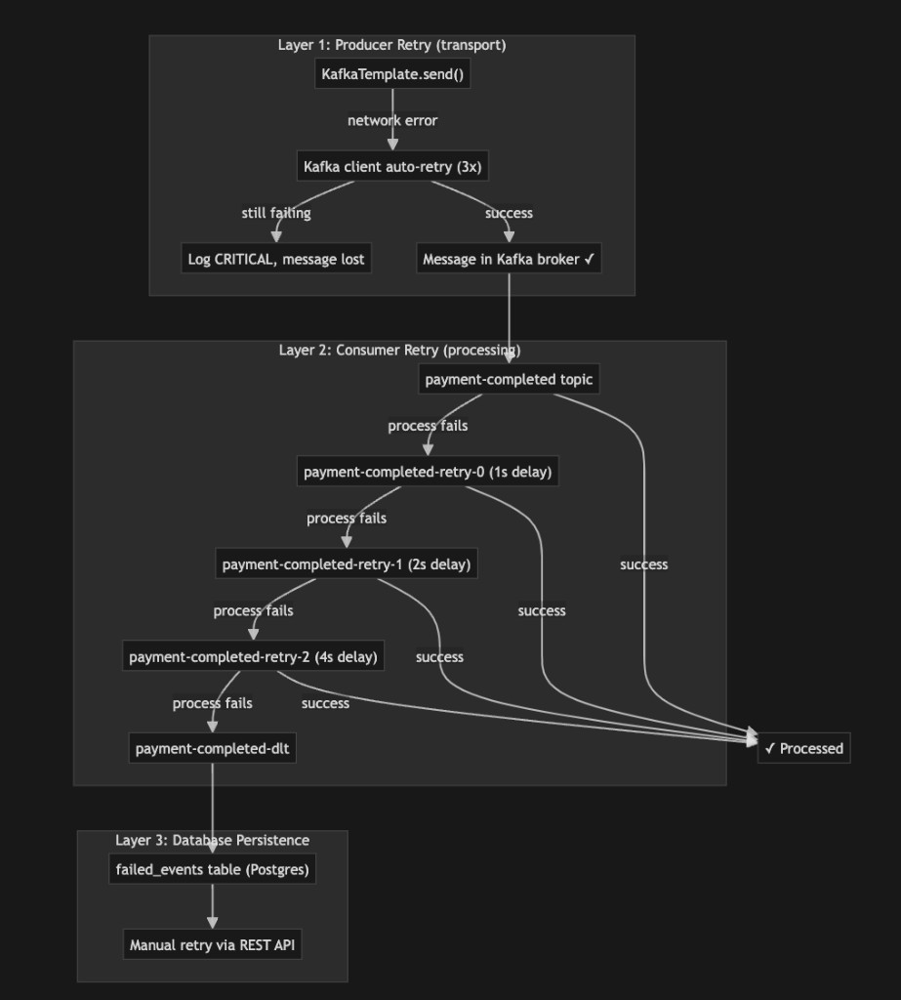

# Retail Platform — Production-Grade Microservices on Kubernetes

A full-stack, Amazon-inspired e-commerce platform built from scratch as a hands-on system design tutorial. Runs entirely on a local Kubernetes cluster using `kind` (Kubernetes IN Docker).

```
┌─────────────────────────────────────────────────────────────────────────────┐
│                          localhost:30080 (Browser)                          │
└────────────────────────────────┬────────────────────────────────────────────┘
                                 │
┌────────────────────────────────▼────────────────────────────────────────────┐
│                     Istio Ingress Gateway (istio-system)                    │
│              Rate Limiting (100 req/s) │ TLS Termination                    │
└────────────────────────────────┬────────────────────────────────────────────┘
                                 │ mTLS (STRICT)
┌────────────────────────────────▼────────────────────────────────────────────┐
│                        retail-app namespace                                 │
│                                                                             │
│  ┌──────────┐    REST    ┌──────────────┐   gRPC   ┌───────────────────┐   │
│  │ Frontend │───────────▶│ User Service │          │ Inventory Service │   │
│  │ Next.js  │    REST    │  (sign JWT)  │          │  (gRPC + REST)    │   │
│  │          │───────────▶├──────────────┤◀─────────┤                   │   │
│  │          │    REST    │Order Service │          └───────────────────┘   │
│  │          │───────────▶│ (orchestrator)│                                  │
│  │          │    REST    ├──────────────┤                                   │
│  │          │───────────▶│Payment Svc   │                                  │
│  └──────────┘            └──────────────┘                                  │
│       Each pod has Envoy sidecar (Istio) + Vault init container            │
└──────────────────────────────┬──────────────────────────────────────────────┘
                               │ Kafka events
┌──────────────────────────────▼──────────────────────────────────────────────┐
│                        retail-data namespace                                │
│                                                                             │
│  ┌──────────────┐  ┌─────────────────┐  ┌──────────────────────────────┐   │
│  │  PostgreSQL   │  │ Kafka + Zookeeper│  │  HashiCorp Vault (secrets)  │   │
│  │  4 databases  │  │ 23 topics        │  │  K8s auth + KV v2           │   │
│  └──────────────┘  └─────────────────┘  └──────────────────────────────┘   │
│  ┌──────────────┐                                                          │
│  │  Dragonfly   │  Redis-compatible L2 cache (shared across pods)          │
│  │  :6379       │                                                          │
│  └──────────────┘                                                          │
└─────────────────────────────────────────────────────────────────────────────┘

┌─────────────────────────────────────────────────────────────────────────────┐
│                      retail-observe namespace                               │
│                                                                             │
│  ┌───────────┐  ┌────────┐  ┌────────────┐  ┌──────────────┐  ┌─────────┐ │
│  │ OTel      │  │ Jaeger │  │ Prometheus │  │ Loki+Promtail│  │ Grafana │ │
│  │ Collector │─▶│ :30086 │  │ :30090     │  │              │  │ :30030  │ │
│  └───────────┘  └────────┘  └────────────┘  └──────────────┘  └─────────┘ │
│  ┌──────────────────┐  ┌──────────────┐                                    │
│  │ kube-state-metrics│  │ node-exporter│  K8s object + host-level metrics  │
│  └──────────────────┘  └──────────────┘                                    │
└─────────────────────────────────────────────────────────────────────────────┘
```

---

## Table of Contents

- [Quick Start](#quick-start)
- [Tech Stack](#tech-stack)
- [Architecture Overview](#architecture-overview)
  - [Namespace Isolation](#namespace-isolation)
  - [Local Kubernetes Cluster](#local-kubernetes-cluster)
- [Key Design Decisions](#key-design-decisions)
- [Services](#services)
- [Order Flow & Saga Pattern](#order-flow--saga-pattern)
  - [Order Status Lifecycle](#order-status-lifecycle)
  - [Order Service createOrder Internal Flow](#order-service-createorder-internal-flow)
  - [Kafka Consumers in Order Service](#kafka-consumers-in-order-service)
  - [Kafka Error Handling — 3-Layer Retry Pipeline](#kafka-error-handling--3-layer-retry-pipeline)
- [Security Model](#security-model)
  - [Layered Security Model](#layered-security-model)
  - [JWT Token Structure](#jwt-token-structure)
  - [JWT Authentication Flow](#jwt-authentication-flow)
  - [Vault Integration](#vault-integration)
- [Inter-Service Communication](#inter-service-communication)
- [Kafka Event System](#kafka-event-system)
  - [Kafka Broker Listeners](#kafka-broker-listeners)
  - [Kafka Startup Order](#kafka-startup-order)
- [Service Mesh (Istio)](#service-mesh-istio)
- [Observability Stack](#observability-stack)
  - [OTel Collector Internal Pipeline](#otel-collector-internal-pipeline)
  - [Structured Logging Pipeline](#structured-logging-pipeline)
  - [Pre-Provisioned Grafana Dashboards](#pre-provisioned-grafana-dashboards)
  - [Alerting](#alerting)
  - [Deployment Silencing (Mute Timing)](#deployment-silencing-mute-timing)
- [Infrastructure](#infrastructure)
  - [Resource Governance — Preventing Cascading Failures](#resource-governance--preventing-cascading-failures)
  - [Kubernetes Storage Model](#kubernetes-storage-model-pv--pvc)
  - [User Service — Layered Architecture](#user-service--layered-architecture)
  - [Pod Architecture](#pod-architecture)
- [Project Structure](#project-structure)
- [Scripts Reference](#scripts-reference)
  - [Deployment Pipeline](#deployment-pipeline)
- [Access Points](#access-points)
- [Troubleshooting](#troubleshooting)

---

## Quick Start

### Prerequisites

| Tool | Version | Install |
|------|---------|---------|
| Docker Desktop | Latest | [docker.com](https://docs.docker.com/get-docker/) |
| kind | 0.20+ | `brew install kind` |
| kubectl | 1.28+ | `brew install kubectl` |
| istioctl | 1.20+ | `curl -L https://istio.io/downloadIstio \| sh -` |

Ensure Docker Desktop has at least **8GB RAM** allocated.

### One-Command Deploy

```bash
./scripts/deploy-all.sh
```

This takes ~10-15 minutes and deploys the entire stack:

```
Step 1: Create kind cluster (3 nodes)
Step 2: Generate JWT RSA keys
Step 3: Deploy PostgreSQL (4 databases) + Dragonfly (L2 cache)
Step 4: Deploy Kafka + 23 topics (main + retry + DLT)
Step 5: Deploy HashiCorp Vault + secrets
Step 6: Build Docker images (5 services)
Step 7: Deploy application services (auto-silences alerts during rollout)
Step 8: Deploy Istio service mesh
Step 9: Deploy observability stack (12 dashboards + alerting)
```

### Useful Commands

```bash
./scripts/status.sh                    # Health dashboard
./scripts/build-images.sh user-service # Rebuild one service
./scripts/deploy-all.sh --from 7       # Resume from step 7
./scripts/deploy-all.sh --skip-build   # Re-deploy without rebuilding
./scripts/teardown.sh --full           # Destroy everything
```

---

## Tech Stack

| Layer | Technology | Version |
|-------|-----------|---------|
| **Frontend** | Next.js (App Router, TypeScript, Tailwind CSS) | 16 |
| **Backend** | Spring Boot (Java) | 4.0.3 / Java 25 |
| **Build** | Gradle (Kotlin DSL) | 9.3 |
| **Database** | PostgreSQL | 16 |
| **Migrations** | Flyway | — |
| **Messaging** | Apache Kafka + Zookeeper | 7.6 |
| **Service Mesh** | Istio (Envoy proxy) | 1.20+ |
| **Secrets** | HashiCorp Vault OSS | 1.17 |
| **Container Orchestration** | Kubernetes (kind) | 1.28+ |
| **Caching (L1)** | Caffeine (in-process, 5s TTL) | — |
| **Caching (L2)** | Dragonfly (Redis-compatible, shared across pods) | latest |
| **Tracing** | OpenTelemetry + Jaeger | — |
| **Metrics** | Prometheus + Grafana + kube-state-metrics + node-exporter | — |
| **Logging** | Loki + Promtail | — |
| **Alerting** | Grafana Unified Alerting (Teams + Email via Vault) | — |
| **Auth** | JWT (RS256 asymmetric) | — |
| **gRPC** | Spring gRPC + protobuf | 1.0.2 |
| **Resilience** | Resilience4j (circuit breakers) | 2.2 |
| **Rate Limiting** | Bucket4j (app) + Istio EnvoyFilter (mesh) | — |

---

## Architecture Overview

### Namespace Isolation

The platform uses 3 Kubernetes namespaces for logical separation:

| Namespace | Purpose | Istio Sidecar |
|-----------|---------|---------------|
| `retail-app` | Application services + frontend | Yes (mTLS) |
| `retail-data` | PostgreSQL, Kafka, Zookeeper, Vault, Dragonfly | No |
| `retail-observe` | OTel, Jaeger, Prometheus, Loki, Grafana, kube-state-metrics, node-exporter | No |

### Local Kubernetes Cluster

```
┌─────────────────────────────────────────────────────┐
│  Your Mac (macOS)                                   │
│                                                     │
│  ┌───────────────────────────────────────────────┐  │
│  │  Docker Desktop                               │  │
│  │                                               │  │
│  │  ┌─────────────┐ ┌──────────┐ ┌──────────┐   │  │
│  │  │ Container 1 │ │Container2│ │Container3│   │  │
│  │  │ (K8s control│ │(worker   │ │(worker   │   │  │
│  │  │  plane node)│ │ node 1)  │ │ node 2)  │   │  │
│  │  │             │ │          │ │          │   │  │
│  │  │  ┌───────┐  │ │ ┌──────┐│ │ ┌──────┐ │   │  │
│  │  │  │API    │  │ │ │Spring││ │ │Kafka │ │   │  │
│  │  │  │Server │  │ │ │Boot  ││ │ │Jaeger│ │   │  │
│  │  │  │etcd   │  │ │ │pods  ││ │ │etc.  │ │   │  │
│  │  │  │sched. │  │ │ │      ││ │ │      │ │   │  │
│  │  │  └───────┘  │ │ └──────┘│ │ └──────┘ │   │  │
│  │  └─────────────┘ └──────────┘ └──────────┘   │  │
│  │                                               │  │
│  │  kind creates Docker containers that pretend  │  │
│  │  to be Kubernetes nodes. It's a real cluster. │  │
│  └───────────────────────────────────────────────┘  │
└─────────────────────────────────────────────────────┘
```

---

## Key Design Decisions

### Why kind over minikube / Docker Compose?

`kind` runs a real multi-node Kubernetes cluster inside Docker containers. Unlike Docker Compose (which can't run Istio, NetworkPolicies, or HPA), `kind` gives us the full K8s API. Unlike minikube, it supports multi-node clusters and is lighter on resources.

### Why Single Postgres with 4 Databases?

Each service owns its own database (`user_db`, `order_db`, `payment_db`, `inventory_db`) for data isolation — a core microservices principle. We use a single Postgres container with 4 logical databases to keep the local setup simple. In production, you'd use separate Postgres instances (or RDS) per service.

### Why Gradle over Maven?

Gradle with Kotlin DSL is more concise, has better incremental build support, and aligns with modern Java tooling. The Kotlin DSL provides type-safe build scripts with IDE autocompletion.

### Why Kafka over RabbitMQ?

Kafka's log-based architecture provides message replay, higher throughput, and natural support for event sourcing. Messages are persisted to disk and retained even after consumption — critical for the Saga pattern where events may need reprocessing.

### Why Flyway over Hibernate `ddl-auto`?

Hibernate's `ddl-auto: update` silently alters schemas and can drop columns. Flyway provides version-controlled SQL migrations (`V1__create_users.sql`, `V2__add_index.sql`) that are auditable, repeatable, and safe for production. We set `ddl-auto: validate` so Hibernate only verifies the schema matches entities.

### Why Choreography-based Saga over Orchestration?

With 4 services and a linear flow (Order → Inventory → Payment → Confirmation), choreography keeps services decoupled — each reacts to events independently. An orchestrator (e.g., Temporal, Camunda) adds a central coordinator, which is better for 8+ step flows with complex branching. For our use case, choreography is simpler and avoids a single point of failure.

### Why RSA (RS256) over Shared Secret (HS256) for JWT?

```
Shared Secret (HS256):                RSA Key Pair (RS256):
─────────────────────                 ────────────────────
One key signs AND verifies.           Private key: ONLY User Service (signs)
Every service has the secret.         Public key: ALL services (verify)
If ANY service is compromised,        If Order Service is compromised,
attacker can FORGE tokens.            attacker can READ but NOT FORGE tokens.
```

RS256 enforces least-privilege: only the User Service can mint tokens. Other services can verify but never create fake ones.

### Why Vault over K8s Secrets?

Kubernetes Secrets are just base64-encoded (not encrypted at rest by default), stored in etcd, and visible to anyone with RBAC access. Vault provides encryption, audit logging, automatic lease expiration, dynamic secrets, and Kubernetes-native authentication. Our services authenticate to Vault using their ServiceAccount token — no passwords in config files.

### Why gRPC for Order↔Inventory, REST for Everything Else?

gRPC provides ~10x lower latency than REST for internal calls, strong type contracts via `.proto` files, and bidirectional streaming. We use it for the synchronous `ReserveStock` call where latency matters. REST remains for external/frontend-facing APIs where browser compatibility and human readability matter.

### Why Pre-Create Kafka Topics vs Auto-Create?

Auto-created topics default to 1 partition (no parallelism) and can be created accidentally from typos. We disable `auto.create.topics.enable` at the broker level and provision all 23 topics (main + retry + DLT) in `deploy-kafka.sh`, giving ops full control over partition counts and retention.

### Why `READ_COMMITTED` Transaction Isolation?

`READ_COMMITTED` prevents dirty reads while avoiding the performance overhead of `SERIALIZABLE`. We enforce this at the YAML level and use an AOP advice (`TransactionIsolationEnforcerAdvice`) to prevent developers from accidentally overriding it with `@Transactional(isolation = ...)`.

### Why Two-Tier Caching (Caffeine + Dragonfly)?

L1 (Caffeine, in-process, 5s TTL) eliminates network round-trips for hot reads. L2 (Dragonfly, shared, 5min TTL) ensures cache consistency across pod replicas — when one pod evicts on write, all pods see the fresh data on next L2 read. Dragonfly is Redis-compatible but uses a multi-threaded shared-nothing architecture that delivers higher throughput per node, making it ideal for a single-instance cache layer. Cache stampede is prevented via `@Cacheable(sync=true)`, which holds concurrent callers until the first one populates the cache.

### Why Per-Order Payment Events (not Per-Item)?

Amazon processes payment at the order level, not per item. A single `PaymentCompletedEvent` contains the full list of items. This reduces Kafka traffic, simplifies the Saga, and matches industry practice. Fulfillment services iterate over the embedded items list.

---

## Services

### User Service
**Port:** 8080 | **Database:** `user_db` | **Role:** Authentication & user management

- Registers users with BCrypt password hashing
- Signs JWT tokens with RSA private key (RS256)
- Rate limiting via Bucket4j (token bucket algorithm)
- Only service with the JWT private key

### Order Service
**Port:** 8080 | **Database:** `order_db` | **Role:** Order orchestration (Saga coordinator)

- Creates orders and manages the order lifecycle
- Calls Inventory Service via **gRPC** to reserve stock (synchronous)
- Publishes `order-created` events to Kafka (asynchronous)
- Consumes `inventory-reserved`, `payment-completed`, `payment-failed` events
- Circuit breaker (Resilience4j) on Kafka producer and gRPC client

### Inventory Service
**Port:** 8080 (REST) + 9090 (gRPC) | **Database:** `inventory_db` | **Role:** Product catalog & stock management

- Exposes product catalog via REST (for frontend)
- Exposes `CheckStock` and `ReserveStock` via gRPC (for Order Service)
- Consumes `payment-completed` (confirm deduction) and `payment-failed` (release reservation)
- Two-tier caching: L1 Caffeine (5s TTL, in-process) + L2 Dragonfly (5min TTL, shared)
- `ProductAccessTracker`: sliding-window access counting via hourly-bucketed sorted sets in Dragonfly
- `CacheWarmer`: pre-warms L2 cache on startup using hot product data from access tracker
- Cache stampede protection via `@Cacheable(sync=true)` (distributed locking)
- Optimistic locking on inventory quantities

### Payment Service
**Port:** 8080 | **Database:** `payment_db` | **Role:** Payment processing

- Consumes `order-created` events from Kafka
- Simulated payment gateway with configurable success/failure rates
- Publishes `payment-completed` or `payment-failed` (per-order, with embedded item list)
- Idempotency check: `findByOrderId` prevents duplicate payments

### Frontend
**Port:** 3000 | **Role:** Customer storefront + admin panel

- Next.js 16 with App Router, TypeScript, Tailwind CSS
- Backend-for-Frontend (BFF) pattern: API routes proxy to microservices
- Client-side cart (localStorage) + JWT auth
- Admin dashboard for viewing/retrying failed Kafka events

---

## Order Flow & Saga Pattern

The platform uses a **choreography-based Saga** for distributed transaction management. No central orchestrator — each service reacts to events.

### Happy Path

```
┌─────────────────────────────────────────────────────────────────────┐
│  1. User places order                                               │
│       │                                                             │
│       ▼                                                             │
│  2. Order Service: save order (PENDING)                             │
│       │                                                             │
│       ▼                                                             │
│  3. gRPC ──▶ Inventory Service: ReserveStock()                      │
│       │      (synchronous — need immediate answer)                  │
│       ▼                                                             │
│  4. Order status → INVENTORY_RESERVED                               │
│       │                                                             │
│       ▼                                                             │
│  5. Kafka: publish "order-created" ──────────────┐                  │
│                                                   │                 │
│                                                   ▼                 │
│  6. Payment Service consumes "order-created"                        │
│       │                                                             │
│       ├── SUCCESS ──▶ Kafka: "payment-completed"                    │
│       │                   │                                         │
│       │                   ├──▶ Order Service: status = COMPLETED    │
│       │                   └──▶ Inventory: confirm deduction         │
│       │                                                             │
│       └── FAILURE ──▶ Kafka: "payment-failed"                       │
│                           │                                         │
│                           ├──▶ Order Service: status = FAILED       │
│                           └──▶ Inventory: RELEASE reserved stock    │
│                                (compensating action / rollback)     │
└─────────────────────────────────────────────────────────────────────┘
```

### Order Status Lifecycle

```
┌─────────────────────────────────────────────────────────────────────────────┐
│                    ORDER STATUS LIFECYCLE                                    │
│                                                                             │
│  PENDING ──(all stock reserved)──> INVENTORY_RESERVED                       │
│     │                                     │                                 │
│     │                          (Kafka: order-created sent)                  │
│     │                                     │                                 │
│     │                              ┌──────┴──────┐                          │
│     │                              v             v                          │
│     │                     PAYMENT_COMPLETED  PAYMENT_FAILED                 │
│     │                              │                                        │
│     │                              v                                        │
│     │                     SHIPPED ──> DELIVERED                              │
│     │                                                                       │
│     └──(stock reservation failed)──> CANCELLED                              │
│     └──(user cancels)──────────────> CANCELLED                              │
└─────────────────────────────────────────────────────────────────────────────┘
```

### Order Service `createOrder` Internal Flow

```
┌─────────────────────────────────────────────────────────────────────────────┐
│                         createOrder(userEmail, request)                      │
│                                                                             │
│  ┌──────────────┐    ┌──────────────────┐    ┌────────────────────────┐     │
│  │ Build Order   │───>│ Save to DB       │───>│ For each OrderItem:     │     │
│  │ + OrderItems  │    │ status = PENDING │    │                        │     │
│  │ calc totals   │    │                  │    │  gRPC ──> Inventory    │     │
│  └──────────────┘    └──────────────────┘    │  reserveStock()        │     │
│                                               │         │              │     │
│                                               │    ┌────┴─────┐       │     │
│                                               │    │          │       │     │
│                                               │  SUCCESS    FAIL      │     │
│                                               │    │          │       │     │
│                                               │    v          v       │     │
│                                               │  mark item  CANCEL    │     │
│                                               │  reserved   order     │     │
│                                               └──────┬───────────────┘     │
│                                                      │                      │
│                                                      v                      │
│                                    ┌─────────────────────────────┐          │
│                                    │ Update status =              │          │
│                                    │ INVENTORY_RESERVED           │          │
│                                    └──────────┬──────────────────┘          │
│                                               │                             │
│                                               v                             │
│                                    ┌─────────────────────────────┐          │
│                                    │ Kafka: publish               │          │
│                                    │ "order-created" event        │──────>  │
│                                    │ (for Payment Service)        │  async  │
│                                    └─────────────────────────────┘          │
│                                               │                             │
│                                               v                             │
│                                         Return OrderResponse                │
└─────────────────────────────────────────────────────────────────────────────┘
```

### Failure Scenarios

| Scenario | What Happens | Compensation |
|----------|-------------|--------------|
| Stock unavailable | gRPC returns `success=false` | Order cancelled immediately. No Kafka events. |
| Payment fails | `payment-failed` event published | Order marked FAILED. Inventory releases reserved stock. |
| Kafka publish fails | Circuit breaker opens, fallback logs error | Order stuck in INVENTORY_RESERVED. Admin panel + Grafana alert. |
| Consumer crashes mid-processing | `@RetryableTopic` retries 3-4 times with exponential backoff | After all retries, event goes to DLT, persisted to `failed_events` table. |

### Kafka Consumers in Order Service

```
┌─────────────────────────────────────────────────────────────────────────────┐
│                    KAFKA CONSUMERS (async, later)                            │
│                                                                             │
│  "inventory-reserved"          "payment-completed"      "payment-failed"    │
│         │                             │                        │            │
│         v                             v                        v            │
│  handleInventoryReserved()    handlePaymentCompleted()  handlePaymentFailed()│
│         │                             │                        │            │
│         v                             v                        v            │
│  Mark OrderItem              Order status =            Order status =       │
│  inventoryReserved=true      PAYMENT_COMPLETED         PAYMENT_FAILED      │
│                                                                             │
│  (confirms the gRPC          (order is done!)          (need to release     │
│   reservation we already                                stock later)        │
│   did synchronously)                                                        │
└─────────────────────────────────────────────────────────────────────────────┘
```

### Kafka Error Handling — 3-Layer Retry Pipeline

The platform implements a 3-layer defense for Kafka message reliability:



**Layer 1 — Producer Retry (transport):** The Kafka client automatically retries failed sends (network errors) up to 3 times with idempotent delivery. If the broker is unreachable after all retries, the message is lost and a CRITICAL log is emitted.

**Layer 2 — Consumer Retry (processing):** If a consumer fails to process a message, Spring Kafka's `@RetryableTopic` moves it through dedicated retry topics with exponential backoff delays (1s → 2s → 4s). At any retry stage, a successful processing short-circuits to "Processed." After all retries are exhausted, the message lands in the Dead Letter Topic (DLT).

**Layer 3 — Database Persistence:** The `@DltHandler` persists failed events to a `failed_events` table in Postgres. Operations teams can review these via the Admin Panel (frontend) or Grafana dashboard, and manually retry via REST API.

```
Message arrives on main topic (e.g., "payment-completed")
    │
    ▼
Processing fails? ──▶ @RetryableTopic retries with exponential backoff
    │                  (retry-0, retry-1, retry-2 topics)
    ▼
All retries exhausted? ──▶ Dead Letter Topic (payment-completed-dlt)
    │
    ▼
@DltHandler persists to failed_events DB table
    │
    ▼
Ops reviews via Admin Panel (frontend) or Grafana dashboard
    │
    ▼
Manual retry via REST API: POST /api/admin/failed-events/{id}/retry
```

---

## Security Model

### JWT Authentication Flow

```
┌────────────────┐     POST /api/auth/login          ┌────────────────┐
│                │ ──────────────────────────────────▶│                │
│    Browser     │                                    │  User Service  │
│                │◀──────────────────────────────────│  (private key) │
└───────┬────────┘     { token: "eyJhbG..." }        └────────────────┘
        │                                                    │
        │  Authorization: Bearer eyJhbG...                   │ signs with
        │                                                    │ RSA private key
        ▼                                                    │
┌────────────────┐     verify with public key        ┌──────▼─────────┐
│  Order Service │ ◀─────────────────────────────────│  Public Key    │
│  Payment Svc   │     (cannot forge tokens)         │  (shared via   │
│  Inventory Svc │                                    │   Vault)       │
└────────────────┘                                    └────────────────┘
```

### Layered Security Model

The platform implements defense-in-depth with 6 security layers:

```
Layer 1: K8s NetworkPolicy     → IP + port filtering (L3/L4)
Layer 2: Istio mTLS             → encrypted + identity-verified traffic
Layer 3: Istio AuthorizationPolicy → HTTP method + path + service identity (L7)
Layer 4: Spring Security + JWT  → user authentication + role-based access
Layer 5: Bucket4j rate limiting → per-user business-level throttling
Layer 6: Istio rate limiting    → global DDoS protection at gateway
```

### JWT Token Structure

```
eyJhbGciOiJSUzI1NiJ9.eyJzdWIiOiJqb2huQGVtYWlsLmNvbSIsInJvbGUiOiJDVVNUT01FUiIsImV4cCI6MTcwOTEyMzQ1Nn0.signature

Decoded:
┌──────────────────────────────────────────┐
│ Header:  { "alg": "RS256" }              │
│ Payload: {                               │
│   "sub": "john@email.com",              │  ← who
│   "role": "CUSTOMER",                    │  ← what they can do
│   "iat": 1709037056,                     │  ← when issued
│   "exp": 1709123456                      │  ← when it expires
│ }                                        │
│ Signature: RSA-SHA256(header+payload,    │
│            private_key)                  │  ← tamper-proof seal
└──────────────────────────────────────────┘
```

### Key Security Features

| Feature | Implementation |
|---------|---------------|
| Password hashing | BCrypt (adaptive cost factor) |
| JWT signing | RS256 (RSA 2048-bit asymmetric) |
| Secrets management | HashiCorp Vault with K8s auth |
| Service-to-service encryption | Istio mTLS (STRICT mode) |
| Authorization | Istio AuthorizationPolicies (default-deny + explicit allow) |
| Rate limiting | Bucket4j (per-service) + Istio EnvoyFilter (global 100 req/s) |
| Network isolation | K8s NetworkPolicies (L3/L4) + Istio AuthorizationPolicies (L7) |
| CORS | Configured per-service; BFF proxy eliminates cross-origin in K8s |
| Transaction isolation | `READ_COMMITTED` enforced via AOP advice |

### Vault Integration

#### Vault Init and Unseal Flow

When Vault starts for the first time, it goes through initialization and unsealing:

```
Uninitialized → init → Sealed → unseal → Ready
                  │                │
                  ▼                ▼
         Generates:         Requires unseal key(s)
         - Unseal keys      to decrypt the master
         - Root token        encryption key
```

In production, auto-unseal delegates this to a cloud KMS:

```
┌──────────────────────────────────────────────────────┐
│                                                      │
│  Vault's master key is encrypted by...               │
│       ▼                                              │
│  Cloud KMS (AWS KMS / GCP Cloud KMS / Azure Key Vault)│
│                                                      │
│  The KMS key is protected by...                      │
│       ▼                                              │
│  The cloud provider's hardware security modules (HSMs)│
│                                                      │
│  HSMs are protected by...                            │
│       ▼                                              │
│  Physical security at the data center                │
│  (armed guards, biometrics, Faraday cages)           │
│                                                      │
└──────────────────────────────────────────────────────┘
```

#### Secrets Distribution to Pods

```
                    ┌─────────────────────────────┐
                    │     HashiCorp Vault          │
                    │     (retail-data namespace)  │
                    │                              │
                    │  secret/jwt/private-key  ──────── RSA private key
                    │  secret/jwt/public-key   ──────── RSA public key
                    │  secret/database/*       ──────── DB credentials
                    │                              │
                    │  Policies:                   │
                    │    user-service → private+public+db │
                    │    app-service  → public+db  │
                    └──────────┬───────────────────┘
                               │
                    K8s Auth Method
                    (verifies SA tokens)
                               │
              ┌────────────────┼────────────────────┐
              ▼                ▼                     ▼
    ┌──────────────┐  ┌──────────────┐    ┌──────────────┐
    │ User Service │  │ Order Service│    │ Payment Svc  │
    │ Pod          │  │ Pod          │    │ Pod          │
    │              │  │              │    │              │
    │ SA: user-svc │  │ SA: order-svc│    │ SA: pay-svc  │
    │ ↓            │  │ ↓            │    │ ↓            │
    │ vault-agent  │  │ vault-agent  │    │ vault-agent  │
    │ (init)       │  │ (init)       │    │ (init)       │
    │ ↓            │  │ ↓            │    │ ↓            │
    │ Fetches:     │  │ Fetches:     │    │ Fetches:     │
    │ - private key│  │ - public key │    │ - public key │
    │ - public key │  │ - db creds   │    │ - db creds   │
    │ - db creds   │  │              │    │              │
    │ ↓            │  │ ↓            │    │ ↓            │
    │ Writes to    │  │ Writes to    │    │ Writes to    │
    │ /vault/      │  │ /vault/      │    │ /vault/      │
    │ secrets/     │  │ secrets/     │    │ secrets/     │
    │ (tmpfs RAM)  │  │ (tmpfs RAM)  │    │ (tmpfs RAM)  │
    │ ↓            │  │ ↓            │    │ ↓            │
    │ App reads    │  │ App reads    │    │ App reads    │
    │ files        │  │ files        │    │ files        │
    └──────────────┘  └──────────────┘    └──────────────┘
```

The private key only exists in two places: Vault's encrypted storage and the User Service pod's tmpfs (RAM). It never touches disk.

```
1. File on tmpfs (/vault/secrets/jwt-private-key.pem)
   └── tmpfs = RAM-backed filesystem, NOT disk
   └── Exists for the lifetime of the pod
   └── When pod dies → RAM freed → gone

2. Java heap memory (PrivateKey object in JwtService)
   └── Exists for the lifetime of the JVM process
   └── When JVM stops → garbage collected → gone
```

#### Pod Authentication Flow

```
Pod starts
    │
    ▼
Init container (vault-agent) authenticates to Vault
using the pod's ServiceAccount JWT token
    │
    ▼
Vault verifies token with K8s TokenReview API
    │
    ▼
Vault returns secrets scoped to the service's policy
(e.g., user-service gets private+public key; others get public key only)
    │
    ▼
Secrets written to in-memory volume (tmpfs, never touches disk)
    │
    ▼
Main container reads secrets from /vault/secrets/
```

---

## Inter-Service Communication

| Path | Protocol | Why |
|------|----------|-----|
| Browser → Frontend | HTTP | Standard web |
| Frontend → Backend services | REST (via BFF proxy) | Browser-compatible, human-readable |
| Order → Inventory (stock check/reserve) | **gRPC** | Low latency, strong contracts, ~10x faster than REST |
| Order → Payment (trigger processing) | **Kafka** (async) | Decoupled, resilient to downstream failures |
| Payment → Order (result notification) | **Kafka** (async) | Eventual consistency via Saga |
| Payment → Inventory (confirm/release) | **Kafka** (async) | Compensating actions for Saga |

### Why Kafka? Sync vs Async

**Synchronous (problem):**

```
Order Service --HTTP call--> Payment Service --HTTP call--> Inventory Service
     │                              │                              │
     │  If Payment Service is       │                              │
     │  down, Order Service         │                              │
     │  FAILS immediately.          │                              │
     └──────── PROBLEM ─────────────┘──────────────────────────────┘
```

**Asynchronous (with Kafka):**

```
Order Service --publish "OrderCreated"--> [ Kafka Topic ] --consume--> Payment Service
                                                          --consume--> Inventory Service

If Payment Service is down:
  - The event sits safely in Kafka (stored on disk)
  - When Payment Service comes back, it picks up where it left off
  - Order Service doesn't even know Payment was down
```

### gRPC Contract

```protobuf
service InventoryGrpc {
  rpc CheckStock(CheckStockRequest) returns (CheckStockResponse);
  rpc ReserveStock(ReserveStockRequest) returns (ReserveStockResponse);
}
```

Both Order Service and Inventory Service share the same `.proto` file. Code is generated at build time via the Gradle protobuf plugin.

---

## Kafka Event System

### Topics (23 total)

| Category | Topics |
|----------|--------|
| **Main** (5) | `order-created`, `inventory-reserved`, `inventory-released`, `payment-completed`, `payment-failed` |
| **Retry** (14) | `*-retry-0`, `*-retry-1`, `*-retry-2` per consumed topic per service |
| **DLT** (4) | `order-created-dlt`, `inventory-reserved-dlt`, `payment-completed-dlt`, `payment-failed-dlt` |

All topics are provisioned at the infrastructure level by `deploy-kafka.sh`. Application code has `autoCreateTopics = "false"` and the broker has `auto.create.topics.enable = false`.

### Kafka Broker Listeners

```
┌─────────────────────────────────────────────────────────┐
│ Kafka Broker                                            │
│                                                         │
│   Listener: INTERNAL (port 9092)                        │
│   ├── Listens on: 0.0.0.0:9092 (all interfaces)        │
│   ├── Advertises: kafka.retail-data.svc...:9092         │
│   └── Used by: Spring Boot services inside K8s          │
│                                                         │
│   Listener: EXTERNAL (port 29092)                       │
│   ├── Listens on: 0.0.0.0:29092                        │
│   ├── Advertises: localhost:29092                       │
│   └── Used by: Your Mac for debugging                   │
│                                                         │
└─────────────────────────────────────────────────────────┘
```

External access from your Mac reaches Kafka via kind's NodePort mapping:

```
Your Mac
  │
  │  localhost:30003  (kind port mapping from cluster config)
  ▼
kind Docker container
  │
  │  NodePort 30003 → pod port 29092
  ▼
Kafka pod (EXTERNAL listener on 29092)
```

### Kafka Startup Order

```
1. Zookeeper starts first (no dependencies)
       │
       ▼
2. Kafka starts, connects to Zookeeper
       │
       ▼
3. Topics are created inside Kafka
       │
       ▼
4. Microservices connect to Kafka (after deployment)
```

### Producer Reliability

```yaml
retries: 3
enable.idempotence: true
max.in.flight.requests.per.connection: 1
delivery.timeout.ms: 30000
```

Idempotent producer ensures exactly-once delivery to the broker. Circuit breaker (Resilience4j) wraps the Kafka template with fallback logging.

### Consumer Reliability

- `ErrorHandlingDeserializer` wraps `JsonDeserializer` to handle poison pills
- `@RetryableTopic` with exponential backoff (1s, 2s, 4s...)
- Dead Letter Topics for exhausted retries
- Failed events persisted to database for manual review

---

## Service Mesh (Istio)

### What Istio Provides

| Feature | Configuration |
|---------|--------------|
| **mTLS** | `PeerAuthentication` STRICT in `retail-app`, PERMISSIVE in `retail-data` |
| **Traffic routing** | `Gateway` + `VirtualService` routes `/api/*` to backend services |
| **Load balancing** | `DestinationRule` with `LEAST_REQUEST` algorithm |
| **Circuit breaking** | Outlier detection: eject pod after 3 consecutive 5xx errors for 30s |
| **Retries** | VirtualService retries on 5xx/reset/connect-failure |
| **Rate limiting** | `EnvoyFilter` on ingress gateway: 100 req/s global |
| **Authorization** | Default-deny + explicit ALLOW rules per service identity (SPIFFE) |
| **Observability** | Access logs (JSON), 100% trace sampling to Jaeger |

### Traffic Flow

```
Browser → localhost:30080
    │
    ▼
Istio Ingress Gateway (NodePort 30080)
    │
    ├── /api/auth/*     → user-service:80
    ├── /api/users/*    → user-service:80
    ├── /api/products/* → inventory-service:80
    ├── /api/inventory/*→ inventory-service:80
    ├── /api/orders/*   → order-service:80
    ├── /api/payments/* → payment-service:80
    └── /* (default)       → frontend:3000
```

---

## Observability Stack

### Telemetry Pipeline

```
Spring Boot apps                    Istio Envoy sidecars
    │ (OTLP traces + metrics)           │ (access logs)
    ▼                                    ▼
┌──────────────────┐            ┌──────────────────┐
│  OTel Collector  │            │    Promtail      │
│  (traces+metrics)│            │  (log shipper)   │
└────────┬─────────┘            └────────┬─────────┘
         │                               │
    ┌────┴────┐                          │
    ▼         ▼                          ▼
┌────────┐ ┌────────────┐         ┌──────────┐
│ Jaeger │ │ Prometheus │         │   Loki   │
│(traces)│ │ (metrics)  │         │  (logs)  │
└────┬───┘ └─────┬──────┘         └────┬─────┘
     │           │                     │
     └───────────┼─────────────────────┘
                 ▼
          ┌──────────────┐
          │   Grafana    │
          │ (dashboards) │
          └──────────────┘
```

### OTel Collector Internal Pipeline

The OpenTelemetry Collector receives, processes, and exports telemetry data:

```
   Services (metrics/traces/logs)
       │
       ▼
   ┌──────────────────────────┐
   │  OTel Collector          │
   │  ┌──────────┐           │
   │  │ Receivers │ ← OTLP, Prometheus, Zipkin
   │  └────┬─────┘           │
   │       ▼                 │
   │  ┌──────────┐           │
   │  │Processors│ ← batch, filter, transform
   │  └────┬─────┘           │
   │       ▼                 │
   │  ┌──────────┐           │
   │  │ Exporters│ → Jaeger, Prometheus, Loki
   │  └──────────┘           │
   └──────────────────────────┘
```

### Structured Logging Pipeline

Application logs flow through an async pipeline to avoid impacting request latency:

```
App thread: log.info("Stock reserved") → puts event in ring buffer → continues immediately
BG thread:  reads from buffer → formats JSON → writes to stdout
```

Promtail (DaemonSet) tails container stdout and ships logs to Loki:

```
┌──────────────────────────────────────────────────────────────────────┐
│  App Pod                                                             │
│  App Thread ──(nanoseconds)──> Async Ring Buffer ──(BG thread)──>   │
│                                                    Container stdout  │
└──────────────────────────────────┬───────────────────────────────────┘
                                   │
┌──────────────────────────────────▼───────────────────────────────────┐
│  Promtail Pod (DaemonSet, fully decoupled)                           │
│  Tails container log files ──(batch push)──> Loki                    │
└──────────────────────────────────────────────────────────────────────┘
```

### Pre-Provisioned Grafana Dashboards

All dashboards are provisioned as code in `k8s/observability/grafana.yaml` and deployed automatically.

| # | Dashboard | Key Panels |
|---|-----------|------------|
| 1 | **Service Overview** | HTTP request rate, error rate, P99 latency, JVM heap, HikariCP connections, Kafka consumer lag, circuit breaker state |
| 2 | **JVM Deep Dive** | Heap/non-heap memory, GC pause times, thread counts, class loading |
| 3 | **Database & HikariCP** | Connection pool usage, active/idle/pending, acquisition time |
| 4 | **Kafka Deep Dive** | Consumer lag per group, message rate, partition assignment, retry/DLT rates |
| 5 | **Failed Events & Logs** | DLT log stream, DLT message rate per service, CRITICAL log events |
| 6 | **Istio Service Mesh** | Request volume, success rate, P99 latency per service pair, mTLS status |
| 7 | **System Resources** | CPU/memory per pod, resource requests vs limits |
| 8 | **PostgreSQL Server** | Active connections, transaction rate, cache hit ratio, table sizes |
| 9 | **Kubernetes Cluster** | Node CPU/memory, pod status, container restarts, OOM kills, HPA scaling, PVC usage, restart reasons table |
| 10 | **Frontend Performance** | Request rate via Istio, response codes, Envoy-level latency |
| 11 | **Dragonfly Cache** | Hit/miss ratio, connected clients, memory usage, evictions, command rate |
| 12 | **Business KPIs** | Orders per minute, revenue, payment success rate, average order value |

### Alerting

Grafana Unified Alerting is configured with two contact points:

| Contact Point | Channel | Severity | Repeat Interval |
|---|---|---|---|
| **Email** (via SMTP) | Email to on-call team | Critical only | 4 hours |
| **Microsoft Teams** | Teams webhook | Critical + Warning | Critical: 4h, Warning: 12h |

Alerting credentials (SMTP password, Teams webhook URL) are stored in **HashiCorp Vault** at `secret/grafana/alerting` and injected at pod startup via a Vault Agent init container — no plaintext secrets in Kubernetes.

**Alert rules** (16 total) cover:

- **Availability:** Pod CrashLooping, Postgres Down, Prometheus Down, Dragonfly Down
- **Performance:** High P99 latency (>2s), High error rate (>5%), JVM heap pressure (>85%)
- **Kafka:** High consumer lag (>1000), DLT messages detected
- **Infrastructure:** Node CPU (>85%), Node memory (>85%), Node disk (>80%)
- **Cache:** Dragonfly hit rate (<50%), Dragonfly memory (>80%), Dragonfly evictions

Rules with `noDataState: OK` prevent false positives when metrics are absent (e.g., no traffic). "Down" rules use `noDataState: Alerting` since missing `up` metrics indicate a genuine outage.

### Deployment Silencing (Mute Timing)

A pre-provisioned **"deployment-window" mute timing** is always visible in Grafana UI under Alerting → Mute Timings. During deployments, `deploy-services.sh` automatically activates it to suppress false alerts caused by pod restarts, then deactivates it once all pods are healthy.

```bash
./scripts/grafana-silence.sh activate   # Suppress all notifications
./scripts/grafana-silence.sh deactivate # Resume notifications
```

---

## Infrastructure

### Resource Governance — Preventing Cascading Failures

Three layers prevent any single service from bringing down the namespace or cluster:

```
┌─────────────────────────────────────────────────────────┐
│                    Cluster (8GB)                         │
│                                                         │
│  ┌─────────────────────────────────────────────────┐    │
│  │         retail-app namespace                     │    │
│  │                                                  │    │
│  │  ResourceQuota: 12Gi limit, 6Gi request, 30 pods│    │
│  │  ─────────────────────────────────────────────── │    │
│  │                                                  │    │
│  │  LimitRange: max 1Gi per container               │    │
│  │  ─────────────────────────────────────────────── │    │
│  │                                                  │    │
│  │  ┌──────────┐ ┌──────────┐ ┌──────────┐         │    │
│  │  │inventory │ │  order   │ │ payment  │  ...     │    │
│  │  │ max 6    │ │ max 6    │ │ max 4    │         │    │
│  │  │ 768Mi ea │ │ 768Mi ea │ │ 768Mi ea │         │    │
│  │  └──────────┘ └──────────┘ └──────────┘         │    │
│  └─────────────────────────────────────────────────┘    │
│                                                         │
│  ┌──────────────┐  ┌──────────────┐                     │
│  │ retail-data   │  │retail-observe │  (unaffected)      │
│  └──────────────┘  └──────────────┘                     │
└─────────────────────────────────────────────────────────┘
```

| Layer | What it prevents | How |
|---|---|---|
| **LimitRange** (per-container) | One pod consuming >1Gi | Hard cap of 1Gi per container; rejected at creation |
| **ResourceQuota** (namespace) | All services exhausting the cluster | Total namespace capped at 12Gi limits / 30 pods |
| **HPA behavior** (per-service) | Runaway scale-up / oscillation | Scale up: max 2 pods/60s. Scale down: 1 pod/120s with 300s stabilization |
| **No CPU limits** | JVM startup throttling causing cascading liveness failures | Pods burst CPU during startup, pass probes faster |
| **Liveness failureThreshold: 5** | Premature pod kills during slow restarts | 90s initial delay + 5×30s = 240s grace period |

**JVM container awareness:** All Dockerfiles use `-XX:+UseContainerSupport -XX:MaxRAMPercentage=75.0`, so the JVM automatically sizes its heap to 75% of the container's memory limit.

### Kubernetes Storage Model (PV / PVC)

```
┌─────────────────────────────────────────────────────────────┐
│                                                             │
│  PersistentVolume (PV)         = The actual hard drive      │
│  "A piece of storage that exists in the cluster"            │
│                                                             │
│  PersistentVolumeClaim (PVC)   = A rental agreement         │
│  "I need 1GB of storage, please reserve it for me"          │
│                                                             │
│  Volume Mount                  = Plugging it in             │
│  "Mount that reserved storage at /var/lib/postgresql/data"  │
│                                                             │
└─────────────────────────────────────────────────────────────┘
```

#### PostgreSQL Data Lifecycle with PVC

```
1. StatefulSet creates pod "postgres-0"
   │
   ▼
2. K8s sees the volumeClaimTemplate, creates PVC "postgres-data-postgres-0"
   │
   ▼
3. K8s finds (or auto-creates) a PersistentVolume that satisfies the claim
   (In kind, this is just a directory on the kind node's filesystem)
   │
   ▼
4. PV is bound to the PVC. Pod mounts it at /var/lib/postgresql/data
   │
   ▼
5. Postgres writes all its data there (tables, indexes, WAL logs)
   │
   ▼
6. Pod crashes or gets restarted
   │
   ▼
7. New pod starts, same PVC is re-mounted -> all data is still there ✓
```

#### ConfigMap Flow (Database Init Scripts)

```
init-databases.sql (your file on disk)
        │
        ▼  deploy-database.sh runs: kubectl create configmap --from-file=...
        │
   key:   init-databases.sql
   value: <the SQL content>
        │
        ▼  postgres.yaml volumes section references this ConfigMap
        │
Volume "init-scripts" (K8s makes ConfigMap available as a volume)
        │
        ▼  postgres.yaml volumeMounts section mounts it into the container
        │
/docker-entrypoint-initdb.d/init-databases.sql (file inside the container)
        │
        ▼  Postgres Docker image convention: execute all .sql files here on first boot
```

### User Service — Layered Architecture

```
HTTP Request
    │
    ▼
┌─────────────────────────────────────────────┐
│ JwtAuthenticationFilter                     │
│ "Does this request have a valid JWT?"       │
│ If yes: set user identity in SecurityContext│
└─────────────────┬───────────────────────────┘
                  │
                  ▼
┌─────────────────────────────────────────────┐
│ Controller (AuthController / UserController)│
│ "Parse the HTTP request, call the service"  │
│ Input:  HTTP request body (JSON)            │
│ Output: HTTP response (JSON)                │
└─────────────────┬───────────────────────────┘
                  │
                  ▼
┌─────────────────────────────────────────────┐
│ Service (UserService)                       │
│ "Execute business logic"                    │
│ - Validate business rules                   │
│ - Hash passwords                            │
│ - Generate JWT tokens                       │
│ - Orchestrate repository calls              │
└─────────────────┬───────────────────────────┘
                  │
                  ▼
┌─────────────────────────────────────────────┐
│ Repository (UserRepository)                 │
│ "Talk to the database"                      │
│ Spring Data auto-generates SQL from method  │
│ names: findByEmail → SELECT WHERE email = ? │
└─────────────────┬───────────────────────────┘
                  │
                  ▼
┌─────────────────────────────────────────────┐
│ Entity (User) ←→ Postgres "users" table     │
│ Hibernate maps Java objects to SQL rows     │
└─────────────────────────────────────────────┘
```

### Kubernetes Resources per Service

| Resource | Purpose |
|----------|---------|
| `Deployment` | Manages pod replicas with rolling updates |
| `Service` (ClusterIP) | Internal DNS + load balancing |
| `PodDisruptionBudget` | Guarantees min 1 pod during node drains |
| `HorizontalPodAutoscaler` | Scales 2-6 replicas based on CPU (70% target) with stabilization windows |
| `ServiceAccount` | Identity for Vault auth + Istio SPIFFE |
| `NetworkPolicy` | L3/L4 firewall rules per service |
| `ResourceQuota` | Caps total namespace memory/CPU/pod count |
| `LimitRange` | Per-container max memory (1Gi) and defaults |

### Pod Architecture

```
┌─────────────────────────────────────────────────────────┐
│  Pod: order-service-7d8f9c6b4-x2k9m                    │
│                                                         │
│  ┌──────────────────┐  ┌────────────────────────────┐   │
│  │ Init Container:  │  │ Container: order-service   │   │
│  │ vault-agent      │  │ (Spring Boot on port 8080) │   │
│  │ (fetches secrets │  │                            │   │
│  │  from Vault)     │  │ Reads secrets from         │   │
│  └────────┬─────────┘  │ /vault/secrets/ (tmpfs)    │   │
│           │             └────────────────────────────┘   │
│           │                                              │
│           ▼             ┌────────────────────────────┐   │
│  ┌────────────────┐     │ Sidecar: istio-proxy       │   │
│  │ Shared Volume  │     │ (Envoy — injected by Istio)│   │
│  │ /vault/secrets │     │ Handles mTLS, routing,     │   │
│  │ (in-memory)    │     │ retries, metrics           │   │
│  └────────────────┘     └────────────────────────────┘   │
└─────────────────────────────────────────────────────────┘
```

### Database Schema

| Service | Database | Key Tables |
|---------|----------|------------|
| User | `user_db` | `users` (email, password_hash, role) |
| Order | `order_db` | `orders`, `order_items`, `failed_events` |
| Payment | `payment_db` | `payments`, `failed_events` |
| Inventory | `inventory_db` | `products`, `inventory`, `failed_events` |

All schemas are managed by Flyway migrations. Hibernate runs in `validate` mode only.

---

## Project Structure

```
Project1/
├── frontend/                          # Next.js 16 frontend
│   ├── src/
│   │   ├── app/                       # Pages (App Router)
│   │   │   ├── page.tsx               # Product catalog (home)
│   │   │   ├── products/[id]/         # Product detail
│   │   │   ├── cart/                  # Shopping cart
│   │   │   ├── checkout/             # Checkout flow
│   │   │   ├── orders/               # Order history + detail
│   │   │   ├── login/ & register/    # Authentication
│   │   │   ├── profile/              # User profile
│   │   │   ├── admin/failed-events/  # Admin: failed event dashboard
│   │   │   └── api/                  # BFF proxy routes
│   │   │       ├── auth/[...path]/   #   → user-service
│   │   │       ├── orders/[...path]/ #   → order-service
│   │   │       ├── products/[...path]/#  → inventory-service
│   │   │       ├── payments/[...path]/#  → payment-service
│   │   │       ├── users/[...path]/  #   → user-service
│   │   │       └── admin/[...path]/  #   → aggregated (all services)
│   │   ├── components/               # Navbar, ProductCard, Pagination, etc.
│   │   ├── context/                  # AuthContext, CartContext
│   │   └── lib/                      # api.ts, proxy.ts, types.ts
│   ├── Dockerfile                    # Multi-stage (node:22-alpine)
│   └── .env.local / .env.development
│
├── services/
│   ├── user-service/                 # Auth + user management
│   ├── order-service/                # Order orchestration + Saga
│   ├── inventory-service/            # Product catalog + stock (gRPC + REST)
│   └── payment-service/              # Payment processing
│       └── src/main/
│           ├── java/com/retail/<svc>/
│           │   ├── config/           # SecurityConfig, JwtFilter, AOP
│           │   ├── controller/       # REST controllers + GlobalExceptionHandler
│           │   ├── dto/              # Request/Response DTOs
│           │   ├── entity/           # JPA entities (Lombok)
│           │   ├── grpc/             # gRPC service/client (inventory only)
│           │   ├── kafka/            # Producers, consumers, events, config
│           │   ├── repository/       # Spring Data JPA repositories
│           │   └── service/          # Business logic
│           ├── proto/                # .proto files (inventory only)
│           └── resources/
│               ├── application.yaml  # Spring Boot config
│               └── db/migration/     # Flyway SQL migrations
│
├── k8s/
│   ├── namespaces.yaml              # retail-app, retail-data, retail-observe
│   ├── network-policies.yaml        # L3/L4 firewall rules (retail-app)
│   ├── resource-governance.yaml     # ResourceQuota + LimitRange (retail-app)
│   ├── database/                    # Postgres StatefulSet + Dragonfly StatefulSet + init SQL
│   ├── kafka/                       # Kafka + Zookeeper StatefulSets
│   ├── vault/                       # Vault StatefulSet + policies + ServiceAccounts
│   │                                # vault-policy-grafana.hcl (alerting credentials)
│   ├── services/                    # Deployments + Services + PDB + HPA (with behavior)
│   ├── istio/                       # Gateway, VirtualServices, DestinationRules,
│   │                                # AuthorizationPolicies, PeerAuth, RateLimit, Sidecar
│   └── observability/               # OTel, Jaeger, Prometheus, Loki, Grafana (12 dashboards),
│                                    # kube-state-metrics, node-exporter, alerting, NetworkPolicies
│
├── scripts/
│   ├── deploy-all.sh                # Master orchestrator (one-command deploy)
│   ├── create-cluster.sh            # kind cluster + namespaces
│   ├── generate-jwt-keys.sh         # RSA 2048-bit keypair
│   ├── deploy-database.sh           # Postgres + 4 databases
│   ├── deploy-kafka.sh              # Kafka + 23 topics (main + retry + DLT)
│   ├── deploy-vault.sh              # Vault + secrets + K8s auth + policies
│   ├── deploy-jwt-keys.sh           # JWT keys to K8s Secrets (legacy)
│   ├── build-images.sh              # Docker build + kind load (5 images)
│   ├── deploy-services.sh           # Apply all K8s service manifests
│   ├── deploy-istio.sh              # Istio control plane + mesh config
│   ├── deploy-observability.sh      # Full observability stack
│   ├── status.sh                    # Health dashboard
│   └── teardown.sh                  # Destroy cluster + optional cleanup
│
├── config/
│   ├── jwt/                         # Generated RSA keys (gitignored)
│   └── vault/                       # Vault init keys (gitignored)
│
├── kind-cluster-config.yaml         # 3-node cluster with port mappings
└── .gitignore
```

---

## Scripts Reference

### Deployment Pipeline

```
./scripts/deploy-all.sh
│
├── Step 1: create-cluster.sh        ─── kind cluster + namespaces
├── Step 2: (inline) JWT key gen     ─── RSA 2048-bit keypair
├── Step 3: deploy-database.sh       ─── Postgres + 4 databases + Dragonfly (L2 cache)
├── Step 4: deploy-kafka.sh          ─── Kafka + 23 topics (main + retry + DLT)
├── Step 5: deploy-vault.sh          ─── Vault + secrets + K8s auth + Grafana alerting creds
├── Step 6: build-images.sh          ─── Docker build + kind load (5 images)
├── Step 7: deploy-services.sh       ─── K8s deployments + NetworkPolicies + resource governance
│                                        (auto-silences Grafana alerts during rollout)
├── Step 8: deploy-istio.sh          ─── Service mesh + mTLS + routing
└── Step 9: deploy-observability.sh  ─── OTel + Jaeger + Prometheus + Loki + Grafana (12 dashboards + alerting)
```

| Script | Purpose | Usage |
|--------|---------|-------|
| `deploy-all.sh` | Full stack deployment | `./scripts/deploy-all.sh [--skip-build] [--from N]` |
| `create-cluster.sh` | Create kind cluster | `./scripts/create-cluster.sh` |
| `generate-jwt-keys.sh` | Generate RSA keypair | `./scripts/generate-jwt-keys.sh` |
| `deploy-database.sh` | Deploy Postgres + Dragonfly | `./scripts/deploy-database.sh` |
| `deploy-kafka.sh` | Deploy Kafka + all topics | `./scripts/deploy-kafka.sh` |
| `deploy-vault.sh` | Deploy Vault + configure + Grafana alerting secrets | `./scripts/deploy-vault.sh` |
| `build-images.sh` | Build Docker images | `./scripts/build-images.sh [service-name]` |
| `deploy-services.sh` | Deploy all app services (silences alerts during rollout) | `./scripts/deploy-services.sh` |
| `deploy-istio.sh` | Deploy Istio mesh | `./scripts/deploy-istio.sh` |
| `deploy-observability.sh` | Deploy observability stack | `./scripts/deploy-observability.sh` |
| `grafana-silence.sh` | Activate/deactivate deployment mute timing | `./scripts/grafana-silence.sh activate\|deactivate` |
| `status.sh` | Health check dashboard | `./scripts/status.sh` |
| `teardown.sh` | Destroy everything | `./scripts/teardown.sh [--prune-images] [--full]` |

---

## Access Points

| Service | URL | Credentials |
|---------|-----|-------------|
| **Frontend** | http://localhost:30080 | — |
| **Grafana** | http://localhost:30030 | admin / admin |
| **Jaeger UI** | http://localhost:30086 | — |
| **Prometheus** | http://localhost:30090 | — |
| **Vault UI** | `kubectl port-forward -n retail-data vault-0 8200` → http://localhost:8200 | Root token in `config/vault/init-keys.json` |

---

## Troubleshooting

### Build server with versioning

```bash
cd "/Users/<user>/Documents/Projects/Misc/System Design/Project1" && docker build --no-cache -t frontend:v2 frontend 2>&1 | grep -E 'error|Error|ERR|Type' | head -20
```

### Restart env

```bash
# kubectl rollout restart deployment -n retail-app && kubectl rollout status deployment -n retail-app --timeout=180s
kubectl rollout restart deployment -n retail-app && \
kubectl rollout restart deployment/istio-ingressgateway -n istio-system && \
kubectl rollout status deployment -n retail-app --timeout=180s && \
kubectl rollout status deployment/istio-ingressgateway -n istio-system --timeout=60s
```

### K8s HPA Metrics check

```bash
echo "=== Node metrics ===" && kubectl top nodes 2>&1 && echo "" && echo "=== Pod metrics (retail-app) ===" && kubectl top pods -n retail-app 2>&1 && echo "" && echo "=== HPA status ===" && kubectl get hpa -n retail-app 2>&1
```

### Pod not starting

```bash
kubectl describe pod -n retail-app -l app=<service-name>
kubectl logs -n retail-app -l app=<service-name> --tail=50
kubectl logs -n retail-app -l app=<service-name> -c vault-agent  # init container
```

### Vault init container failing

```bash
# Check if Vault is unsealed
kubectl exec -n retail-data vault-0 -- vault status

# Re-unseal if needed (key is in config/vault/init-keys.json)
kubectl exec -n retail-data vault-0 -- vault operator unseal <UNSEAL_KEY>
```

### Kafka topics missing

```bash
kubectl exec -n retail-data kafka-0 -- kafka-topics --list --bootstrap-server localhost:9092
```

### Istio sidecar not injected

```bash
# Verify namespace label
kubectl get ns retail-app --show-labels

# Check sidecar status
istioctl proxy-status

# Analyze for config issues
istioctl analyze -n retail-app
```

### Rebuild and redeploy a single service

```bash
./scripts/build-images.sh order-service
kubectl rollout restart deployment/order-service -n retail-app
kubectl rollout status deployment/order-service -n retail-app
```

### Pod OOM (Out of Memory) kills

```bash
# Check if pods are being OOM-killed
kubectl describe pod -n retail-app <pod-name> | grep -A 5 "Last State"
# Look for: Reason: OOMKilled, Exit Code: 137

# Check actual memory usage vs limits
kubectl top pods -n retail-app

# View OOM history in Grafana → Kubernetes Cluster dashboard
# Panels: "OOM Killed Containers", "Pod Memory Usage vs Limit", "Container Restart Reasons"
```

If OOM-killed, increase the memory limit in `k8s/services/<service>.yaml` and re-apply. The JVM auto-sizes heap to 75% of the container limit via `-XX:MaxRAMPercentage=75.0`.

### Dragonfly (L2 cache) debugging

```bash
# Connect to Dragonfly CLI
kubectl exec -it -n retail-data dragonfly-0 -- redis-cli

# Check cache size and memory
> DBSIZE
> INFO memory

# List cache keys for a service
> KEYS inventory-service:*

# Check hot product access tracking
> KEYS product:access:*

# Flush all cache (use with caution)
> FLUSHALL
```

### View Kafka consumer lag

```bash
kubectl exec -n retail-data kafka-0 -- kafka-consumer-groups \
  --bootstrap-server localhost:9092 --describe --all-groups
```

---

## Build Steps (Tutorial Order)

This project was built incrementally across 11 steps, each adding a layer:

| Step | What Was Built |
|------|---------------|
| 1 | Kubernetes cluster (kind) + namespaces |
| 2 | PostgreSQL (single container, 4 databases) + Dragonfly (L2 cache) |
| 3 | Apache Kafka + Zookeeper |
| 4 | User Service (JWT auth, BCrypt, Vault, rate limiting) |
| 5 | Inventory Service (gRPC + REST, caching, stock management) |
| 6 | Order Service (Saga orchestrator, gRPC client, circuit breakers) |
| 7 | Payment Service (simulated gateway, idempotency, per-order events) |
| 8 | React/Next.js Frontend (BFF proxy, admin panel, cart, checkout) |
| 9 | Istio Service Mesh (mTLS, routing, auth policies, rate limiting) |
| 10 | Observability Stack (OTel, Jaeger, Prometheus, Loki, Grafana, 12 dashboards, alerting) |
| 11 | Automation Scripts + Final Integration (deploy-all, Kafka topic refactor) |

## License

This project is licensed under the [PolyForm Noncommercial License 1.0.0](LICENSE.md). You are free to use, modify, and share this software for any **non-commercial** purpose, including personal learning, research, education, and hobby projects. Commercial use requires a separate license from the author.
